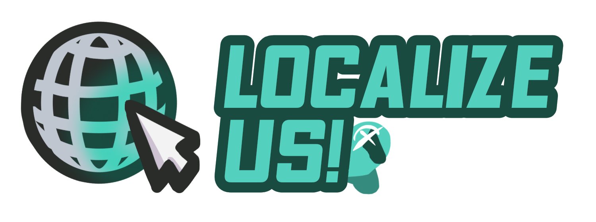

> [!NOTE]
> This repo is still under active development, and is only public for contributions prior to the initial release.

-----------------------

  
  
Localize Us!

  
  
  

 

A client-side [Among Us](https://store.steampowered.com/app/945360/Among_Us) mod for adding extra languages into the game!

-----------------------

# Actively Supported Languages

All languages are added via our [Weblate](https://weblate.duikbo.at/projects/localize-us/) instance. If you want to contribute to the project (even if the language isn't listed here!) please let us know!

|     Language     |                                                                          Overall Progress                                                                           |
|:----------------:|:-------------------------------------------------------------------------------------------------------------------------------------------------------------------:|
|  All Languages   |        |
|      Czech       |   |
|      Greek       |   |
| Literary Chinese |  |
|    Lithuanian    |   |
|      Polish      |   |
|     Swedish      |   |
|     Turkish      |   |

-----------------------

# License
This software is distributed under the GNU GPLv3 License. BepInEx is distributed under the LGPL-2.1 License.

# Copyright

This mod is not affiliated with Among Us or Innersloth LLC, and the content contained therein is not endorsed or otherwise sponsored by Innersloth LLC. Portions of the materials contained herein are property of Innersloth LLC.

© Innersloth LLC.

